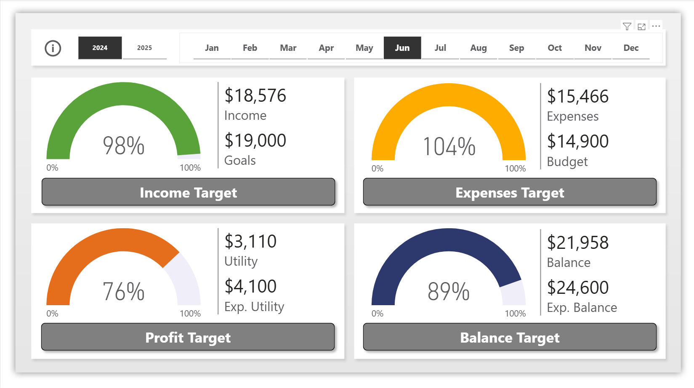
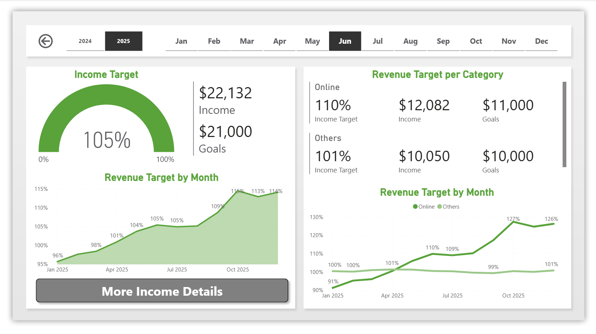
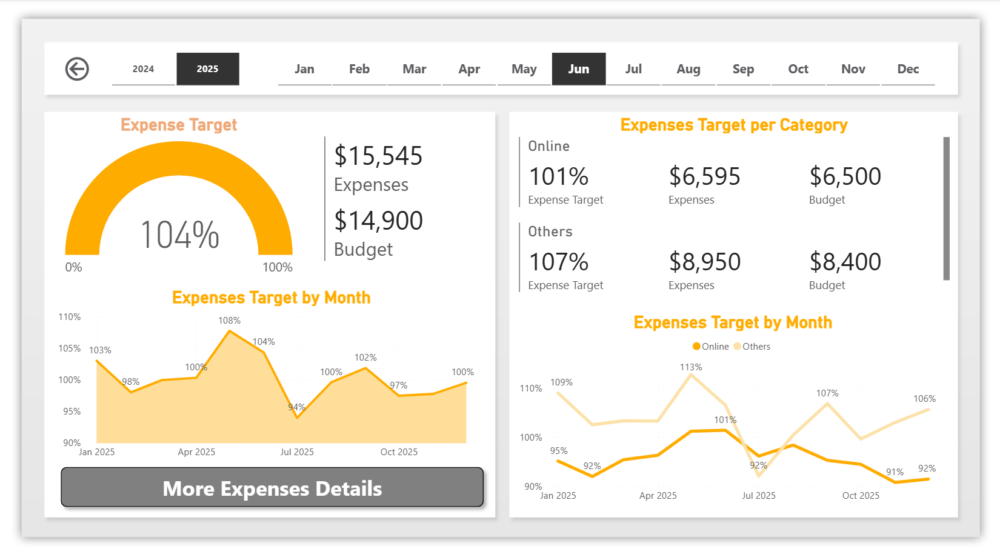
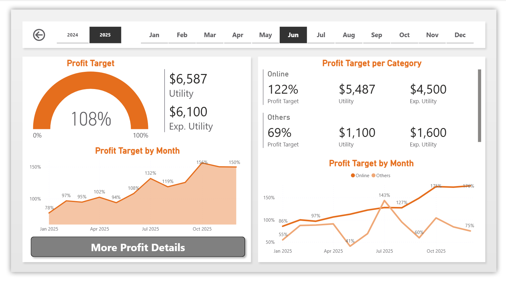
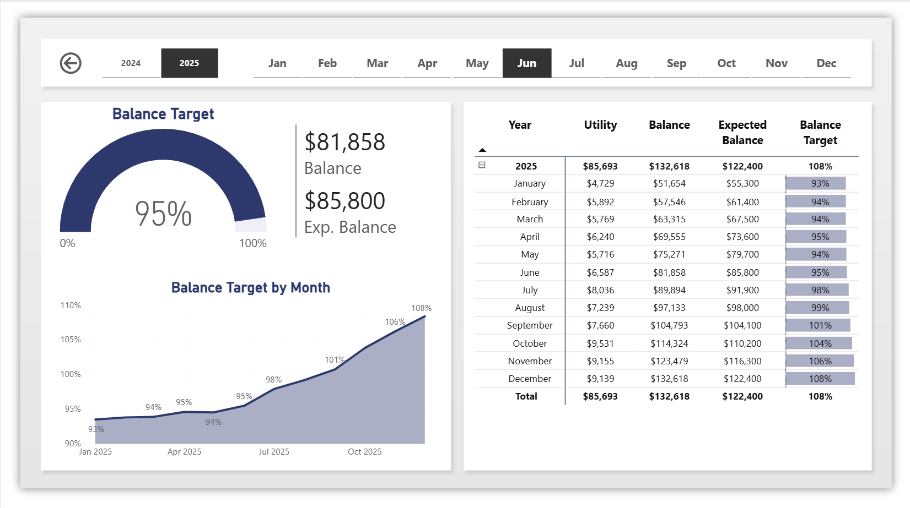
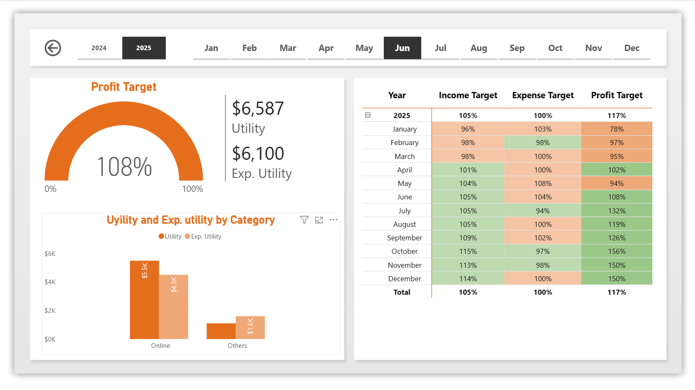
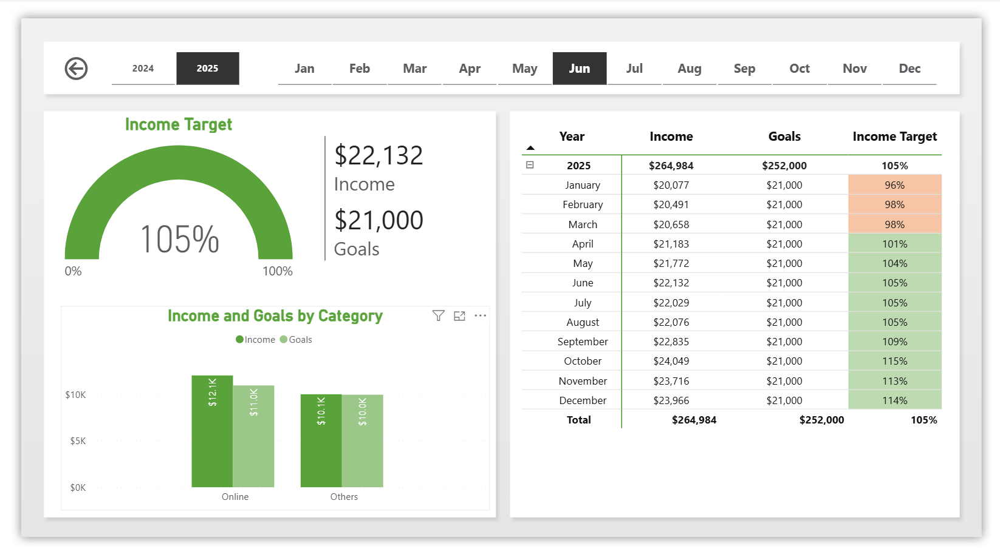
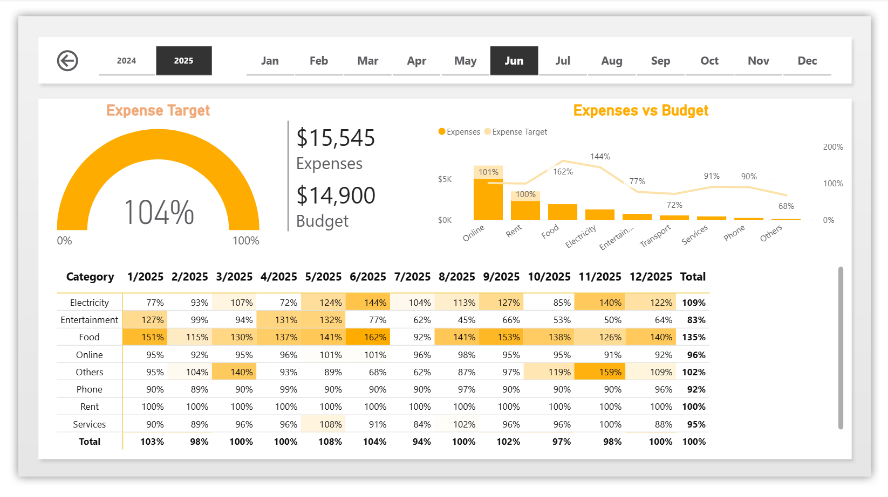

# 📊 Personal Finance Performance Dashboard

An interactive **Personal Finance Analytics Dashboard** built in **Power BI** to monitor income, expenses, profit, and financial balance against predefined targets.

This project transforms financial data into **clear and actionable insights**, allowing users to understand their financial health and make informed decisions.

---

# 🎯 Project Objective

The objective of this project is to create a **data-driven personal finance monitoring system** that allows users to:

- Track **income vs financial goals**
- Monitor **expenses vs budget**
- Analyze **profit performance**
- Evaluate **balance growth over time**
- Identify financial trends and patterns

The dashboard helps transform raw financial data into **visual insights that support smarter financial decision-making**.

---

# 🛠 Tools & Technologies

- Power BI  
- Data Modeling  
- DAX Measures  
- Financial KPI Analysis  
- Data Visualization Best Practices  

---

# 🏠 Main Overview Page

The **Main Dashboard** provides a high-level overview of financial performance.

## Key Features

- KPI gauges for financial targets
- Actual vs Expected value comparison
- Monthly and yearly filters
- Quick financial health overview

## KPIs Included

- Income Target
- Expenses Target
- Profit Target
- Balance Target

This page allows users to quickly evaluate whether their financial performance is **meeting expectations or falling behind targets**.

---

# 💰 Income Target Page

This page focuses on **income performance compared to revenue goals**.

## Insights Provided

- Income vs Goals comparison
- Monthly revenue trends
- Category performance analysis
- Revenue distribution (Online vs Others)

## Business Value

Helps users identify:

- Revenue growth patterns
- Strongest income sources
- Underperforming months

---

# 📉 Expenses Target Page

This page evaluates **spending behavior compared to planned budgets**.

## Insights Provided

- Expenses vs Budget comparison
- Monthly expense performance
- Spending trends over time

## Business Value

Helps detect:

- Overspending months
- Budget inefficiencies
- Expense patterns

---

# 📊 Profit Target Page

Profit is calculated as:

**Profit = Income − Expenses**

This page analyzes profitability against expected profit goals.

## Insights Provided

- Profit vs Expected Profit comparison
- Monthly profit trends
- Category profit analysis
- Online vs Other category performance

## Business Value

Shows how effectively income converts into profit and highlights areas where financial performance can improve.

---

# 💼 Balance Target Page

This page tracks the **cumulative financial balance** and compares it to expected savings targets.

## Insights Provided

- Actual balance vs expected balance
- Savings growth monitoring
- Long-term financial performance

## Business Value

Helps evaluate financial stability and long-term financial progress.

---

# 🔎 More Profit Details Page

This page provides deeper analysis of profit performance.

## Insights Provided

- Profit target achievement by month
- Category-level profit comparison
- Online vs Other profit contribution
- Profit trend visualization

## Business Value

Supports deeper understanding of profit drivers and financial growth opportunities.

---

# 🔎 More Income Details Page

This page provides detailed analysis of revenue performance.

## Insights Provided

- Income trends by month
- Category revenue performance
- Target achievement tracking

## Business Value

Helps understand income stability and identify revenue growth opportunities.

---

# 🔎 More Expenses Details Page

This page offers a granular analysis of expenses.

## Insights Provided

- Expense breakdown
- Budget comparison
- Monthly spending patterns

## Business Value

Helps optimize expenses and improve financial planning.

---

# 📈 Key Insights

Based on the financial analysis:

- Income generally stays close to its target values.
- Some months show **expenses above the planned budget**.
- Profit tends to improve as income stabilizes over time.
- Balance shows **consistent long-term growth**.

These insights highlight how tracking financial performance can support **better financial management and planning**.
